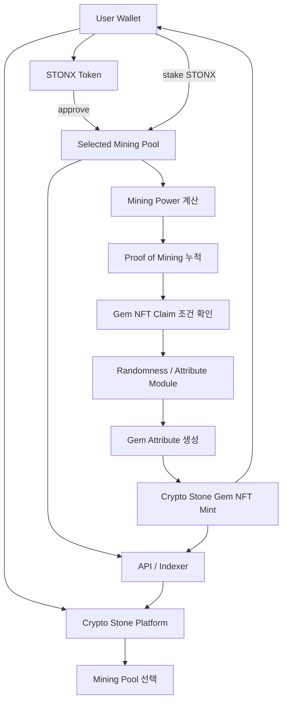

# Smart contract\_v2

> **Testnet Notice**\
> 이 문서는 Crypto Stone Protocol Developer Hub에 추가하기 위한 한국어 초안입니다.\
> 현재 기준은 **Sepolia 테스트넷 / 개발 단계**입니다. 메인넷 배포 전 네트워크, ABI, 감사 여부, API Base URL, 실제 배포 주소를 최종 업데이트해야 합니다.
>
> **Contract Address Policy**\
> 테스트넷 컨트랙트 주소는 계속 추가 배포될 수 있으므로, 본 문서에서는 주소 칸을 의도적으로 비워둡니다.\
> 각 주소는 최종 확인 후 직접 입력합니다.
>
> **Naming / Symbol Policy**\
> 프로젝트 및 프로토콜의 공식 명칭은 **Crypto Stone Protocol**입니다.\
> 실제 운영 토큰 심볼은 **STONX**입니다. 기존 백서 일부에 남아 있는 `STONE` 표기는 레거시 백서 표기로 보고, Developer Hub와 신규 문서에서는 **STONX**를 기준으로 작성합니다.

## 1. 컨트랙트 구조 개요

Crypto Stone Protocol은 단일 토큰, Gem NFT, 12개 Mining Pool, Pool Registry/Factory, 랜덤성 또는 속성 생성 모듈, API/Indexer 레이어로 구성됩니다.

| 구성 요소                                   | 역할                                                  |
| --------------------------------------- | --------------------------------------------------- |
| `STONXToken`                            | Crypto Stone Protocol의 ERC-20 유틸리티 토큰               |
| `CryptoStoneGemNFT`                     | 채굴 결과로 발행되는 ERC-721 Gem NFT                         |
| `MiningPool`                            | 사용자가 STONX를 스테이킹하고 Mining Power / PoM을 누적하는 Pool    |
| `MiningPoolFactory` 또는 `PoolRegistry`   | 12개 Gemstone Pool을 생성, 등록, 조회하는 관리 컨트랙트             |
| `RandomnessModule` 또는 `AttributeModule` | Gem NFT의 속성, 희소도, 랜덤 요소를 생성하거나 검증하는 모듈              |
| `ProtocolConfig`                        | 확률표, 난이도, Pool 설정값, 공개 파라미터를 관리하는 선택 모듈             |
| `API / Indexer`                         | 온체인 데이터를 읽어 플랫폼, Explorer, Dashboard에 제공하는 오프체인 레이어 |

## 2. 전체 흐름

## 3. `STONXToken`

`STONXToken`은 Crypto Stone Protocol의 기본 유틸리티 토큰입니다.\
사용자는 STONX를 보유하고 Pool 컨트랙트에 승인한 뒤, 채굴 풀에 스테이킹할 수 있습니다.

### 주요 역할

| 역할       | 설명                                       |
| -------- | ---------------------------------------- |
| 총 발행량 정의 | 총 발행량은 **1,200,000,000 STONX** 기준        |
| 보유 잔액 관리 | 사용자 지갑별 STONX 잔액 조회                      |
| 전송       | ERC-20 표준 전송                             |
| 승인       | Pool 컨트랙트가 사용자의 STONX를 스테이킹 처리할 수 있도록 승인 |
| 추가 발행 제한 | 최종 배포 후 임의 추가 발행을 제한하는 구조 지향             |

### 주요 Read 함수

| 함수                                          | 설명                      |
| ------------------------------------------- | ----------------------- |
| `name()`                                    | 토큰 이름 조회                |
| `symbol()`                                  | 토큰 심볼 조회: `STONX`       |
| `decimals()`                                | 소수점 자리수 조회              |
| `totalSupply()`                             | 총 발행량 조회                |
| `balanceOf(address account)`                | 특정 지갑의 STONX 잔액 조회      |
| `allowance(address owner, address spender)` | 특정 spender에 대한 승인 수량 조회 |

### 주요 Write 함수

| 함수                                                       | 설명                         |
| -------------------------------------------------------- | -------------------------- |
| `approve(address spender, uint256 amount)`               | Pool 컨트랙트가 사용할 STONX 수량 승인 |
| `transfer(address to, uint256 amount)`                   | STONX 전송                   |
| `transferFrom(address from, address to, uint256 amount)` | 승인된 수량 내에서 STONX 이동        |

## 4. `CryptoStoneGemNFT`

`CryptoStoneGemNFT`는 채굴 결과로 발행되는 디지털 원석 NFT 컨트랙트입니다.\
NFT의 핵심은 이미지 자체가 아니라 원석 타입, 속성, 희소도, 채굴 출처, 발행 시점 등 검증 가능한 데이터입니다.

### 주요 역할

| 역할       | 설명                                     |
| -------- | -------------------------------------- |
| NFT 발행   | Mining Pool Claim 조건 충족 시 Gem NFT 발행   |
| 속성 관리    | 원석 타입, 등급, 희소도, 무게, 색상, 투명도, 컷 등 속성 관리 |
| 소유권 관리   | ERC-721 기준 소유권 및 전송 처리                 |
| 메타데이터    | `tokenURI` 또는 별도 attribute 조회 함수 제공    |
| 발행 권한 제한 | 허가된 Pool 또는 모듈만 NFT를 발행할 수 있도록 제한      |

### 주요 Read 함수

| 함수                          | 설명                     |
| --------------------------- | ---------------------- |
| `ownerOf(uint256 tokenId)`  | NFT 소유자 조회             |
| `balanceOf(address owner)`  | 지갑별 NFT 보유 수량 조회       |
| `tokenURI(uint256 tokenId)` | NFT 메타데이터 URI 조회       |
| `getGem(uint256 tokenId)`   | Gem 속성 조회 함수가 있는 경우 사용 |
| `totalSupply()`             | 전체 발행량 조회 함수가 있는 경우 사용 |

### 주요 Write 함수

| 함수                                                            | 설명                         |
| ------------------------------------------------------------- | -------------------------- |
| `mintGem(address to, GemData data)`                           | 허가된 Pool 또는 모듈이 Gem NFT 발행 |
| `transferFrom(address from, address to, uint256 tokenId)`     | NFT 전송                     |
| `safeTransferFrom(address from, address to, uint256 tokenId)` | 안전 전송                      |

## 5. `MiningPool`

`MiningPool`은 사용자가 STONX를 스테이킹하고 Mining Power 및 Proof of Mining을 누적하는 핵심 컨트랙트입니다.\
12개 Pool은 각각 특정 디지털 원석 타입과 연결됩니다.

### 주요 역할

| 역할                 | 설명                               |
| ------------------ | -------------------------------- |
| STONX Stake        | 사용자가 승인한 STONX를 Pool에 스테이킹       |
| Mining Power 계산    | 스테이킹 수량, 기간, Pool 난이도 등을 기준으로 계산 |
| Proof of Mining 누적 | 사용자의 채굴 참여 이력을 수치화               |
| Claim 조건 확인        | NFT Claim 가능 여부 검증               |
| Gem NFT 발행 요청      | 조건 충족 시 NFT 컨트랙트에 Mint 요청        |
| Unstake            | 조건에 따라 스테이킹된 STONX 반환            |

### 주요 Read 함수

| 함수                            | 설명                           |
| ----------------------------- | ---------------------------- |
| `poolInfo()`                  | Pool 이름, 원석 타입, 난이도, 설정값 조회  |
| `stakedBalance(address user)` | 사용자별 스테이킹 수량 조회              |
| `miningPowerOf(address user)` | 사용자별 Mining Power 조회         |
| `proofOfMining(address user)` | 사용자별 Proof of Mining 조회      |
| `claimable(address user)`     | Gem NFT Claim 가능 여부 조회       |
| `totalStaked()`               | Pool 전체 스테이킹 수량 조회           |
| `remainingGemSupply()`        | 해당 Pool에서 남은 NFT 발행 가능 수량 조회 |

### 주요 Write 함수

| 함수                        | 설명                                |
| ------------------------- | --------------------------------- |
| `stake(uint256 amount)`   | STONX 스테이킹                        |
| `unstake(uint256 amount)` | STONX 언스테이킹                       |
| `claimGem()`              | 조건 충족 시 Gem NFT Claim             |
| `compound()`              | 구조가 있을 경우 Mining Power 또는 PoM 재반영 |
| `sync()`                  | Pool 상태 갱신 함수가 있을 경우 사용           |

## 6. `MiningPoolFactory` 또는 `PoolRegistry`

`MiningPoolFactory` 또는 `PoolRegistry`는 12개 Gemstone Mining Pool의 공식 주소와 상태를 관리합니다.\
플랫폼과 API는 이 컨트랙트를 기준으로 공식 Pool 목록을 표시할 수 있습니다.

| 함수                                     | 설명                        |
| -------------------------------------- | ------------------------- |
| `getPool(uint256 poolId)`              | Pool ID로 Pool 주소 조회       |
| `getPoolByStoneType(string stoneType)` | 원석 타입으로 Pool 주소 조회        |
| `allPools()`                           | 전체 Pool 목록 조회             |
| `isOfficialPool(address pool)`         | 공식 Pool 여부 확인             |
| `createPool(...)`                      | Factory 구조일 경우 신규 Pool 생성 |
| `registerPool(...)`                    | Registry 구조일 경우 Pool 등록   |

## 7. `RandomnessModule` 또는 `AttributeModule`

이 모듈은 Gem NFT의 속성과 희소도를 결정하는 역할을 합니다.\
테스트넷 단계에서는 구현 방식이 바뀔 수 있으므로, 본 문서에서는 구조적 역할 중심으로 설명합니다.

| 항목           | 설명                                                     |
| ------------ | ------------------------------------------------------ |
| Input        | Pool 정보, 사용자 Claim 정보, tokenId, block data, seed 등     |
| Output       | Gem type, rarity, grade, weight, color, clarity, cut 등 |
| Purpose      | NFT 속성 생성과 희소도 검증                                      |
| Finalization | 메인넷 배포 전 랜덤성 방식과 확률표 고정 필요                             |
| Transparency | 확률표, seed 방식, 검증 로직을 공개 문서화하는 것이 좋음                    |

## 8. 주소 등록표

아래 주소 칸은 사용자가 직접 입력할 수 있도록 비워둡니다.

| Contract / Module              | Sepolia Testnet Address | Mainnet Address |
| ------------------------------ | ----------------------- | --------------- |
| STONX Token                    |                         |                 |
| Crypto Stone Gem NFT           |                         |                 |
| Mining Pool Factory / Registry |                         |                 |
| Diamond Pool                   |                         |                 |
| Ruby Pool                      |                         |                 |
| Sapphire Pool                  |                         |                 |
| Emerald Pool                   |                         |                 |
| Amethyst Pool                  |                         |                 |
| Topaz Pool                     |                         |                 |
| Opal Pool                      |                         |                 |
| Aquamarine Pool                |                         |                 |
| Garnet Pool                    |                         |                 |
| Peridot Pool                   |                         |                 |
| Citrine Pool                   |                         |                 |
| Turquoise Pool                 |                         |                 |
| Randomness / Attribute Module  |                         |                 |
| Protocol Config                |                         |                 |

## 9. 보안 및 운영 원칙

* 사용자의 개인키는 플랫폼이나 API가 보관하지 않습니다.
* 모든 Write Transaction은 사용자 지갑에서 직접 서명되어야 합니다.
* API와 Indexer는 조회와 트랜잭션 데이터 생성 보조 역할만 수행합니다.
* 토큰, Pool, NFT의 최종 기준 데이터는 항상 온체인 컨트랙트입니다.
* 메인넷 배포 전 컨트랙트 검증, ABI 공개, 권한 구조 확인, Admin 권한 제거 또는 제한 여부를 문서화해야 합니다.
